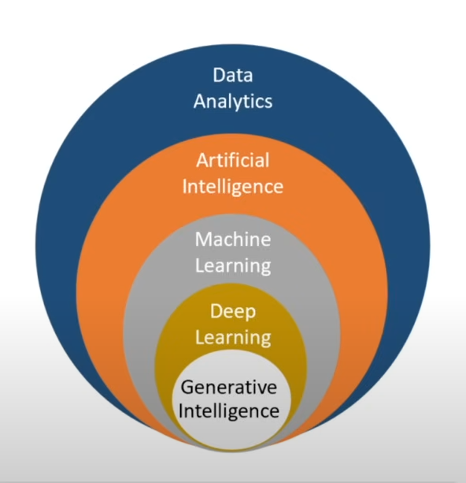

# What is Machine Learning (ML)?
- As the name suggests, ML allows you to learn and make decisions smartly.
- In ML, machines can learn from the data provided or their own experience. It depends upon the type of ML model.

- - -

## Machine Learning Life Cycle

The machine learning lifecycle is a structured process that data scientists and machine learning engineers follow to build, deploy, and maintain machine learning systems. Here's a brief overview of the key stages:

### 1. Data Gathering: 
Identifying and collecting relevant data from various sources.

### 2. Data Preparation: 
Cleaning, preprocessing, and transforming the raw data into a suitable format for modeling. This includes handling missing values, outliers, and feature engineering.

### 3. Model Selection: 
Choosing the appropriate machine learning algorithm or model based on the problem type, data characteristics, and desired1 outcome.

### 4. Model Training: 
Feeding the prepared data to the selected model to learn patterns and relationships. This involves tuning hyperparameters to optimize model performance.

### 5. Model Evaluation: 
Assessing the trained model's performance using appropriate metrics on unseen data to ensure it generalizes well.

### 6. Deployment: 
Integrating the trained and evaluated model into a production environment where it can be used to make predictions or decisions.

### 7. Monitoring and Maintenance: 
Continuously tracking the model's performance in the real world and retraining or updating it as needed to maintain accuracy and address concept drift.

- - -

## Different Branches around Machine Learning

Here's a brief overview of different branches of data and AI (Artificial Intelligence):

1. **Data Analytics**:
   - The broadest field focused on analyzing raw data to extract useful insights and inform decisions.
   - Encompasses statistics, data visualization, and business intelligence.
   - Does not necessarily involve AI.

2. **Artificial Intelligence (AI)**:
   - A subset of data analytics concerned with creating systems that can perform tasks typically requiring human intelligence.
   - Includes areas like reasoning, problem-solving, and understanding language.

3. **Machine Learning (ML)**:
   - A branch of AI that enables systems to learn patterns from data and improve over time without being explicitly programmed.
   - Includes algorithms like decision trees, SVMs, and clustering.

4. **Deep Learning**:
   - A specialized subfield of ML using neural networks with many layers.
   - Excels at tasks like image recognition, natural language processing, and speech recognition.

5. **Generative Intelligence**:
   - The most specialized inner core, referring to systems that can generate new content (text, images, music, code, etc.) based on learned patterns.
   - Examples include GPT (text), DALL·E (images), and other generative models.

- - -
