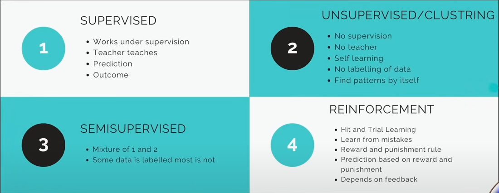

# Types of Machine Learning

There are *four main types of machine learning*, each with different learning strategies based on data and feedback. Here's a breakdown:

---

### **1. Supervised Learning**
- **Description**: The model learns from a labeled dataset (data with input-output pairs).
- **Key Points**:
  - Requires a **teacher** (training data with known outputs).
  - The goal is **prediction** – the model learns to predict the output from input data.
  - Examples: Spam detection, housing price prediction, image classification.
  
---

### **2. Unsupervised Learning (Clustering)**
- **Description**: The model works with **unlabeled data** and tries to find hidden patterns or groupings.
- **Key Points**:
  - No teacher or predefined outcomes.
  - **Self-learning** – the model finds **structure or clusters** in data.
  - Examples: Customer segmentation, anomaly detection, topic modeling.

---

### **3. Semi-Supervised Learning**
- **Description**: A hybrid approach using both **labeled and unlabeled** data.
- **Key Points**:
  - A small portion of data is labeled, while the majority is not.
  - Combines the strengths of supervised and unsupervised learning.
  - Example: Medical image diagnosis where only a few scans are labeled by doctors.

---

### **4. Reinforcement Learning**
- **Description**: The model learns through **trial and error** by interacting with an environment.
- **Key Points**:
  - Based on **feedback** (rewards or punishments).
  - Learns to make decisions to maximize **cumulative rewards** over time.
  - Examples: Game-playing AI (like AlphaGo), robotics, self-driving cars.

---

---

## Algorithms used in different Types of Machine Learning

---

### **1. Supervised Learning Algorithms**
These algorithms require **labeled data** to learn a mapping from inputs to outputs.

#### 🔹 Regression (for continuous output):
- **Linear Regression**
- **Ridge/Lasso Regression**
- **Support Vector Regression (SVR)**

#### 🔹 Classification (for categorical output):
- **Logistic Regression**
- **K-Nearest Neighbors (KNN)**
- **Decision Trees**
- **Random Forest**
- **Support Vector Machines (SVM)**
- **Naive Bayes**
- **Gradient Boosting (e.g., XGBoost, LightGBM)**

---

### **2. Unsupervised Learning Algorithms**
These algorithms work with **unlabeled data**, finding structure or patterns on their own.

#### 🔹 Clustering:
- **K-Means**
- **Hierarchical Clustering**
- **DBSCAN**

#### 🔹 Dimensionality Reduction:
- **Principal Component Analysis (PCA)**
- **t-SNE**
- **Autoencoders (also used in deep learning)**

#### 🔹 Association Rules:
- **Apriori Algorithm**
- **Eclat Algorithm**

---

### **3. Semi-Supervised Learning Algorithms**
These use a **small labeled dataset + a large unlabeled one**, often combining unsupervised and supervised techniques.

- **Self-training with supervised classifiers** (e.g., using a model like SVM or Decision Tree to label unlabeled data iteratively)
- **Label Propagation / Label Spreading**
- **Semi-Supervised Generative Models**
- **Graph-based models** (e.g., Graph Convolutional Networks in deep learning)

---

### **4. Reinforcement Learning Algorithms**
These learn through **interaction with the environment** using rewards and penalties.

#### 🔹 Value-Based Methods:
- **Q-Learning**
- **Deep Q-Networks (DQN)**

#### 🔹 Policy-Based Methods:
- **REINFORCE Algorithm**
- **Proximal Policy Optimization (PPO)**
- **Trust Region Policy Optimization (TRPO)**

#### 🔹 Actor-Critic Methods:
- **Advantage Actor-Critic (A2C, A3C)**

---

