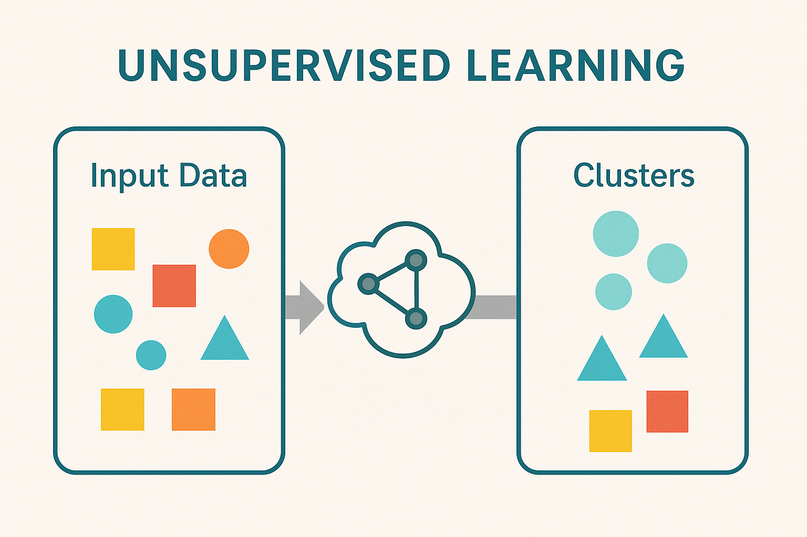

# Unsupervised Machine Learning

**Unsupervised Learning** is a type of machine learning where the model is **not provided with labeled data**. Instead, it tries to **find patterns, structures, or groupings** in the input data on its own.

---

### 🔍 **Key Characteristics**
- **No labels**: Input data has no associated output.
- **No supervision**: The model isn’t told what to predict.
- **Goal**: Discover hidden patterns or groupings.

---

### 🧠 **Main Techniques**
1. **Clustering** – grouping similar data points.
2. **Dimensionality Reduction** – simplifying data by reducing features.
3. **Anomaly Detection** – identifying unusual data points.
4. **Association Rule Mining** – finding relationships between variables.

---

### 📊 **Technical Examples**

#### 1. **Clustering (e.g., K-Means)**
- **Use case**: Customer segmentation.
- **Explanation**: Group customers based on buying behavior into clusters like “budget buyers”, “premium buyers”, etc., without prior labels.

#### 2. **Principal Component Analysis (PCA)**
- **Use case**: Dimensionality reduction in image processing.
- **Explanation**: Reduces the number of features in an image dataset while retaining the most important data.

#### 3. **Autoencoders**
- **Use case**: Data compression, denoising images.
- **Explanation**: A neural network learns to compress and reconstruct input data by learning its structure.

#### 4. **DBSCAN**
- **Use case**: Detecting clusters of arbitrary shape (like in spatial/geographic data).
- **Explanation**: Groups data based on density, detecting outliers as noise.

---

### 🌍 **Real-life Examples**

#### 1. **Music/Video Recommendation**
- Platforms like Spotify and Netflix cluster users based on preferences and suggest content without explicitly labeled data.

#### 2. **Market Basket Analysis**
- Stores analyze which items are bought together to optimize product placement (e.g., diapers often bought with baby wipes).

#### 3. **Social Network Analysis**
- Detecting communities or clusters of people with similar interests without labeling each relationship.

#### 4. **Anomaly Detection in Finance**
- Unsupervised algorithms can detect unusual spending patterns that might indicate fraud.

---

