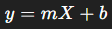

### 🔹 1. **Single Linear Regression** (Simple Linear Regression)

**Definition**:
Single linear regression models the relationship between **one independent variable** (`X`) and **one dependent variable** (`y`).

**Equation**:



Where:

* y = predicted value
* X = input feature
* m = slope (coefficient)
* b = intercept

**Example (Code)**:

```python
from sklearn.linear_model import LinearRegression
import numpy as np

# One feature (1D array reshaped to 2D for sklearn)
X = np.array([1, 2, 3, 4, 5]).reshape(-1, 1)
y = np.array([2, 4, 6, 8, 10])

model = LinearRegression()
model.fit(X, y)

print("Coefficient:", model.coef_)
print("Intercept:", model.intercept_)
```

---

### 🔹 2. **Multiple Linear Regression**

**Definition**:
Multiple linear regression models the relationship between **two or more independent variables** (`X1, X2, ..., Xn`) and **one dependent variable** (`y`).

**Equation**:


**Example (Code)**:

```python
from sklearn.linear_model import LinearRegression
import numpy as np

# Two features
X = np.array([
    [1, 2],
    [2, 3],
    [3, 4],
    [4, 5]
])
y = np.array([5, 7, 9, 11])

model = LinearRegression()
model.fit(X, y)

print("Coefficients:", model.coef_)
print("Intercept:", model.intercept_)
```

---

### 📊 Table: Difference Between Single and Multiple Linear Regression

| Feature                        | Single Linear Regression | Multiple Linear Regression          |
| ------------------------------ | ------------------------ | ----------------------------------- |
| Number of Independent Features | 1                        | 2 or more                           |
| Equation                       |              |  |
| Visualization                  | 2D Line                  | Multidimensional Plane (3D or more) |
| Complexity                     | Simple                   | More Complex                        |
| Used For                       | Predict using 1 factor   | Predict using multiple factors      |

---

### ⚙️ Working of Linear Regression in `sklearn`

1. **Fitting the Model**:

   * The model tries to find the best-fit line/plane by minimizing the **Mean Squared Error (MSE)** between actual values and predicted values.

2. **Training Process**:

   * Uses the **Ordinary Least Squares (OLS)** method to calculate the **coefficients** and **intercept**.

3. **Prediction**:

   * Once trained, the model uses the equation to predict new outputs for given inputs.

---

### ❓ Why Linear Regression Works Only with Numeric Data

**Reason**:

* Linear regression involves **mathematical operations** like addition, multiplication, and computing gradients.
* You cannot multiply or add non-numeric (categorical) data directly.

**Example of Invalid Data**:

```python
X = [['Red'], ['Blue'], ['Green']]  # Cannot perform math on strings
```

#### ✅ Solution:

* Convert categorical data to numeric using **One-Hot Encoding** or **Label Encoding**:

```python
from sklearn.preprocessing import OneHotEncoder

encoder = OneHotEncoder()
encoded = encoder.fit_transform([['Red'], ['Blue'], ['Green']]).toarray()
```

---

### ✅ Summary

* **Single Linear Regression**: 1 input ➝ 1 output
* **Multiple Linear Regression**: multiple inputs ➝ 1 output
* Both models find the **best linear relationship** to predict outcomes.
* They require **numeric** input data since mathematical calculations are involved.
