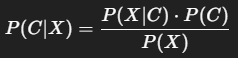

## 🔹 1. What is **Naive Bayes**?

**Naive Bayes** is a **supervised classification algorithm** based on **Bayes' Theorem** with a strong (naive) assumption:

> **All features are conditionally independent given the class.**

---

### 📌 **Bayes’ Theorem**:



Where:

* **P(C|X):** Posterior – Probability of class `C` given features `X`
* **P(X|C):** Likelihood – Probability of features `X` given class `C`
* **P(C):** Prior – Probability of class `C`
* **P(X):** Evidence – Probability of features `X` (common to all classes)

---

## 🔹 2. Types of Naive Bayes (in `sklearn`)

| Type              | Used For                                | Assumes Features Are           |
| ----------------- | --------------------------------------- | ------------------------------ |
| **GaussianNB**    | Continuous features (like age, income)  | Normally distributed           |
| **MultinomialNB** | Discrete counts (e.g. word frequencies) | Count data (positive integers) |
| **BernoulliNB**   | Binary/Boolean features (0/1)           | Binary (presence/absence)      |

---

## 🔹 3. How Naive Bayes Works (Step-by-step)

1. **Calculate Priors**:

   * For each class, calculate the probability _P(C)_
2. **Calculate Likelihoods**:

   * For each feature, compute the probability of the value given a class _P(X_i|C)_
3. **Apply Bayes’ Theorem**:

   * For each class, calculate _P(C|X)_
4. **Predict the Class** with the **highest posterior probability**

---

## 🔸 4. Code Examples

### 🧪 Example 1: **GaussianNB** (for numeric features)

```python
from sklearn.naive_bayes import GaussianNB
from sklearn.model_selection import train_test_split
from sklearn.metrics import accuracy_score

X = [[1.8, 6.0], [1.9, 6.5], [2.0, 7.0], [3.5, 10.5]]  # height, weight
y = [0, 0, 0, 1]  # class labels

model = GaussianNB()
model.fit(X, y)

pred = model.predict([[2.1, 7.2]])
print("Predicted class:", pred)
```

---

### 📦 Example 2: **MultinomialNB** (text classification)

```python
from sklearn.naive_bayes import MultinomialNB
from sklearn.feature_extraction.text import CountVectorizer

X = ["I love cats", "I hate cats", "cats are great"]
y = [1, 0, 1]  # 1 = positive, 0 = negative

vectorizer = CountVectorizer()
X_counts = vectorizer.fit_transform(X)

model = MultinomialNB()
model.fit(X_counts, y)

test = vectorizer.transform(["I love animals"])
print("Prediction:", model.predict(test))
```

---

### 🟢 Example 3: **BernoulliNB** (binary features)

```python
from sklearn.naive_bayes import BernoulliNB

X = [[0, 1, 0], [1, 0, 1], [0, 1, 1]]
y = [0, 1, 0]

model = BernoulliNB()
model.fit(X, y)

print("Prediction:", model.predict([[1, 0, 0]]))
```

---

## 📊 5. Table: Types of Naive Bayes in `sklearn`

| Feature      | GaussianNB            | MultinomialNB            | BernoulliNB            |
| ------------ | --------------------- | ------------------------ | ---------------------- |
| Data Type    | Continuous (floats)   | Discrete (counts)        | Binary (0/1)           |
| Assumption   | Normal distribution   | Multinomial distribution | Bernoulli distribution |
| Common Use   | Medical, IRIS dataset | Text classification      | Spam filtering         |
| Input Values | Real numbers          | Non-negative integers    | 0 or 1                 |

---

## ❓ Why Naive Bayes Requires Numeric/Categorical Data?

### ➤ Reason:

* Bayes’ theorem **relies on probability**, and computing probability requires **numerical values**.
* Features must be **quantifiable** (numeric or counts or binary) to compute likelihoods.

---

### ✅ Solution for Text or Categories:

* Use **text vectorizers** like `CountVectorizer`, `TfidfVectorizer` to turn words into numeric counts.
* Use **LabelEncoder** or **OneHotEncoder** for categorical features.

---

### 🧠 Summary

| Feature         | Naive Bayes Overview                          |
| --------------- | --------------------------------------------- |
| Goal            | Classify based on probability                 |
| Based on        | Bayes' Theorem with independence assumption   |
| Types           | Gaussian, Multinomial, Bernoulli              |
| Works On        | Numeric, binary, or encoded text data         |
| Doesn’t Work On | Raw text or raw strings without preprocessing |

---
